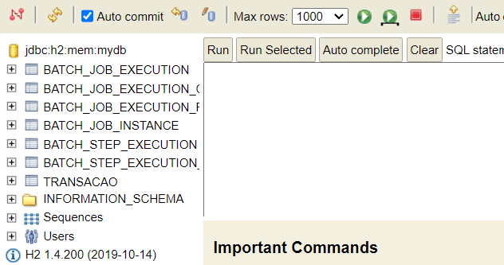
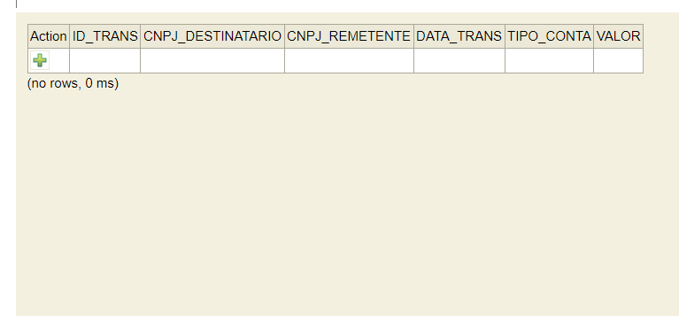
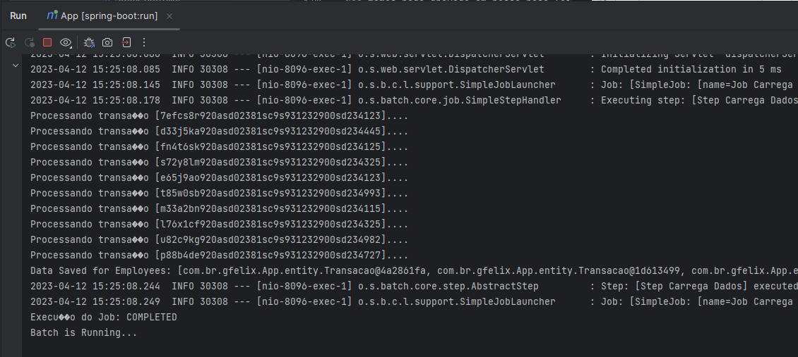
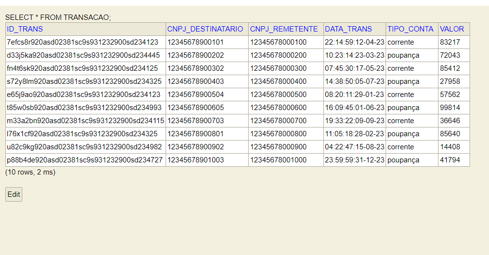

App Transacoes - Java Batch
===========================

**Pré-requisitos**
- JAVA 8
- Maven 3.3+
- IDE de sua preferência

*****
**Esse projeto se iniciou na minha busca por aprender sobre Spring Batch. Recomendo olhar essa super [video-aula](https://www.youtube.com/watch?v=6iDzOi2YWxA) (é em inglês)**
## Introdução
**Spring Batch** é um framework desenhado para trabalhar
com batchs ou seja em lotes, trabalhar com grandes e repetitivos
volumes de dados. 

"_O processamento
em lote é o método que os computadores usam para concluir 
periodicamente trabalhos de dados repetitivos de alto volume_" [¹](https://aws.amazon.com/pt/what-is/batch-processing/#:~:text=Batch%20processing%20is%20the%20method,run%20on%20individual%20data%20transactions.) - Aws site

Tem a classe `FlatFileItemReader` que possibilita a nós
lermos arquivos "flat" como por exemplo Csv (arquivo excel).
Neste caso iremos ler um arquivo em CSV e inputar esses dados a
uma base de dados (H2)

**Este é um projeto Básico de Spring Batch - Bons estudos! Para uma intodrução ao assunto recomendo esta [vídeo-aula](https://www.youtube.com/watch?v=6iDzOi2YWxA) e o [livro](https://github.com/gustavohfelixs/Ebook-The-Definitive-guide-to-spring-batch-modern-finite-batch-processing)**

#### Como utilizar o projeto?
1. Baixe o arquivo para seu computador como zip
2. extraia o arquivo zip
3. Import para sua IDE como projeto Maven

## Instale as dependências
`mvn clean install`

### Clean and Build
`mvn clean package`

### Executar projeto
`mvn spring-boot:run`  Ou  `java -jar ./target/App-0.0.1-SNAPSHOT.jar`    Você também pode rodar de a classe **AppApplication** em sua IDE que está no caminho `com.br.gfelix.App.AppApplication`

Entendendo o Projeto
====================

Pacotes (não é um padrão):
* **config** - Responsável por guardar as configurações
spring, suas classes recebem ``@Configuration`` como anotação. É aqui que vamos
e que vamos configurar nossos Jobs e steps 
* **entity** - Guarda as classes principais do negócio, as entidades que vão se tornar tabelas
no nosso banco de Dados, tem uma classe java normal com seus atributos e os Gettes, Setters e construtores.
  (Optei por usar de annotations Lombok para gerar os Getters, Setters e construtores: `@Getters @Setters @AllArgsConstructor @NoArgsConstructor`)
* **repository** - Guarda o repositório
* **step** - Guarda classes que implementam nossos steps configurados no package `config`

### Funcionalidade

Input tem um arquivo csv chamado `transacoes.csv` que contém  os seguintes itens: 
* **idTrans** - `"7efcs8r920asd02381sc9s931232900sd234123 - string"`
* **cnpjRemetente** `12345678000100 - string`
* **cnpjDestinatario** `12345678900101 - string`
* **tipoConta** `corrente/ poupanca - string`
* **valor** `3000 - Integer`
* **dataCriacao** `22:14:59:12-04-23 - string`

_**curiosidade**: O arquivo csv foi feito pela IA chatgpt, uma dica para quem quer t
trabalhar com diferentes tipos de dados e não quer desprender tempo criando um arquivo._

A aplicação lê esses dados coluna a coluna, processa e joga tudo em um banco de dados.

## Hands on
Rode a aplicação com os comandos demonstrados anteriormente em  `Instale as Dependências` e digite no seu navegador http://localhost:8096/h2-console para acessar 
a base de dados.  

No campo JDBC Url digite `jdbc:h2:mem:mydb` e clique `connect`.

Clique em TRANSACAO e em run para rodar o comando que inspeciona a base de dados.

Não temos nada gravado em nossa base (ainda).

Para gravar os dados na base de dados foi criado o end-point `"/run"` - acesse em http://localhost:8096/run

É possível ver isso no terminal de nossa IDE, significa que deu certo. Vamos checkar a base de dados!

Deu certo! 

Foi meu primeiro app usando o Spring Batch, bons estudos e até mais!